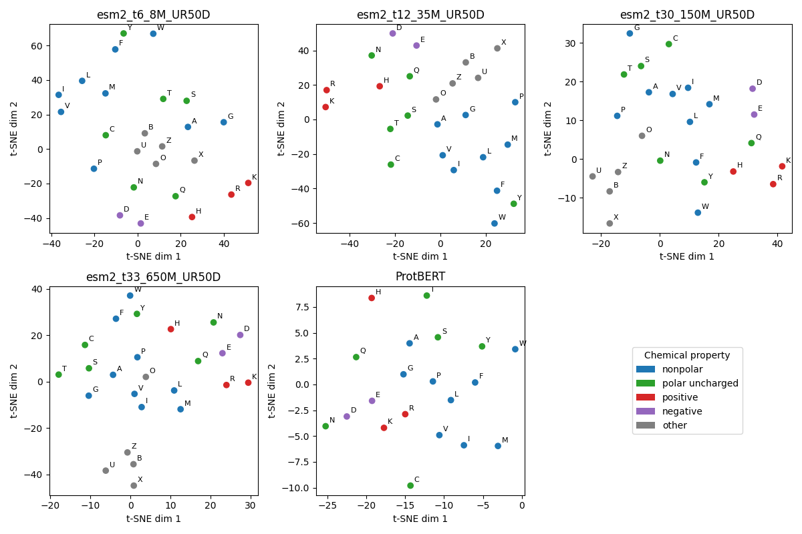

# ProtAAEmbed
A study of the amino acid embedding for different protein language models. 

## Results

We look at the embedding of five different models, and check if the models learn an embedding that cluster amino acids of the same chemical properties. There are $20$ amino acids and $5$ other ambiguous ones (idk). 
For the $20$ amino acids, there are a four chemical properties that they can belong to. 
For the embedding, the $25$ tokens get maped to a high-dimensional space. To test if they cluster according to their chemical properties, we train a Kmeans algorithm, and use the purity, adjusted rand index (ARI), and normalized mutual information (NMI) metrics to test the performance. 
The results are summarized in the following table. 
| Model | Purity | ARI | NMI |
|-------|--------|-----|-----|
| esm2_t6_8M_UR50D | 0.560 | 0.047 | 0.388 |
| esm2_t12_35M_UR50D | 0.680 | 0.363 | 0.562 |
| esm2_t30_150M_UR50D | 0.680 | 0.258 | 0.567 |
| esm2_t33_650M_UR50D | 0.600 | 0.192 | 0.416 |
| ProtBERT | 0.500 | -0.016 | 0.208 |

We also visualize the clustering using a t-SNE representation of the embedding as shown in the following figure: 

It seems that the esm_t12_35M_UR50D model has the best clustering property, as indicated by the t-SNE plot and the purity and ARI metrics. 

